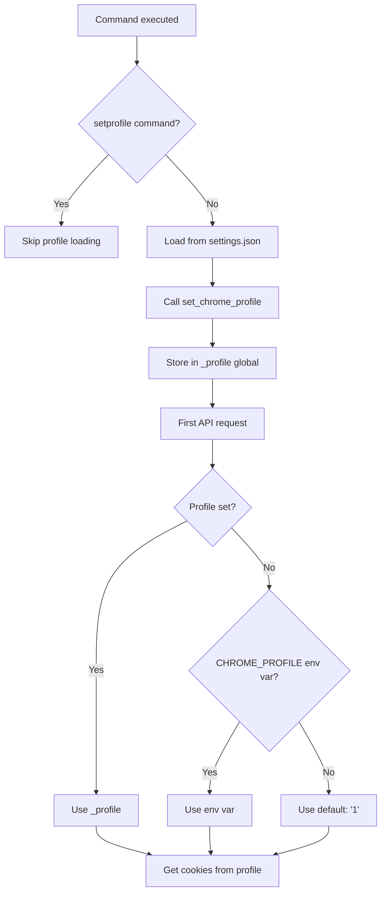

## Overview

Chrome profiles allow you to maintain separate browser sessions with different logins, bookmarks, and settings. hawkx uses Chrome profiles to access different X accounts.

<Info>
  Each Chrome profile has its own set of cookies, so you can be logged into multiple X accounts simultaneously—one per profile.
</Info>

## How Chrome Profiles Work

Chrome stores each profile in a separate directory:

```
~/Library/Application Support/Google/Chrome/
├── Default/           # First profile ("Profile 0")
├── Profile 1/         # Second profile
├── Profile 2/         # Third profile
└── Profile 3/         # Fourth profile
```

Each profile directory contains:
- `Cookies` - SQLite database with encrypted session cookies
- `History` - Browsing history
- `Preferences` - Settings and configuration
- Extensions, bookmarks, and other profile-specific data

## Setting Your Profile

hawkx stores your active Chrome profile in `~/.hawkx/settings.json`.

### Using `setprofile` Command

```bash
# Set profile by number
hawkx setprofile 1

# Set profile by full name
hawkx setprofile 'Profile 1'

# Use Default profile
hawkx setprofile Default
```

This creates or updates `~/.hawkx/settings.json`:

```json
{
  "profile": "1"
}
```

### Profile Name Format

hawkx accepts profiles in multiple formats:

| Input | Actual Profile | Notes |
|-------|----------------|-------|
| `1` | `Profile 1` | Numeric shorthand (auto-converted) |
| `2` | `Profile 2` | Numeric shorthand |
| `Profile 1` | `Profile 1` | Full name |
| `Profile 2` | `Profile 2` | Full name |
| `Default` | `Default` | First profile |

<Note>
  **Profile number mapping:**
  - `"1"` → `Profile 1`
  - `"2"` → `Profile 2`
  - etc.
  
  This conversion happens in `_chrome_profile_path()` (`creds.py:27-32`).
</Note>

## Default Profile

If no profile is configured, hawkx uses:
1. Profile from `~/.hawkx/settings.json` if present
2. Profile from `CHROME_PROFILE` environment variable if set
3. `"1"` (Profile 1) as fallback

```python
# From client.py:29
profile = _profile or os.environ.get("CHROME_PROFILE", "1")
```

### Temporary Profile Override

You can override the configured profile for a single command:

```bash
# Use Profile 2 for this command only
CHROME_PROFILE=2 hawkx getuser elonmusk 20

# Use Default profile temporarily
CHROME_PROFILE=Default hawkx getbookmarks 50
```

## Multiple Account Setup

Use Chrome profiles to manage multiple X accounts:

<Steps>
  <Step title="Create Chrome profiles">
    In Chrome:
    1. Click your profile icon (top-right)
    2. Click "Add" → "Sign in"
    3. Create a new profile (can skip Google sign-in)
    4. Repeat for each X account
  </Step>

  <Step title="Log into X in each profile">
    For each Chrome profile:
    1. Switch to that profile
    2. Navigate to [x.com](https://x.com)
    3. Log in with a different X account
    4. Keep the session active
  </Step>

  <Step title="Identify profile numbers">
    Profiles are numbered starting from 1:
    - First additional profile: `Profile 1`
    - Second additional profile: `Profile 2`
    - etc.
    
    Or check the directory names in:
    ```bash
    ls ~/Library/Application\ Support/Google/Chrome/
    ```
  </Step>

  <Step title="Configure hawkx for each account">
    ```bash
    # Use account in Profile 1
    hawkx setprofile 1
    hawkx getbookmarks 20
    
    # Switch to account in Profile 2
    hawkx setprofile 2
    hawkx getuser someuser 50
    
    # Switch to account in Profile 3
    hawkx setprofile 3
    hawkx getpost 1234567890
    ```
  </Step>
</Steps>

## Settings File Structure

The settings file is stored at `~/.hawkx/settings.json`:

```json
{
  "profile": "1"
}
```

### Implementation

From `hawkx/settings.py`:

```python
SETTINGS_DIR = os.path.expanduser("~/.hawkx")
SETTINGS_PATH = os.path.join(SETTINGS_DIR, "settings.json")

def load() -> dict:
    if not os.path.exists(SETTINGS_PATH):
        return {"profile": "1"}  # Default to Profile 1
    with open(SETTINGS_PATH) as f:
        return json.load(f)

def get_profile() -> str:
    return load().get("profile", "1")

def set_profile(profile: str) -> None:
    data = load()
    data["profile"] = profile
    save(data)
```

### Manual Editing

You can edit the file directly:

```bash
# Create/edit settings file
vim ~/.hawkx/settings.json
```

```json
{
  "profile": "2"
}
```

<Warning>
  Ensure the JSON is valid. Invalid JSON will cause hawkx to fail loading settings.
</Warning>

## Profile Selection Flow

Here's how hawkx determines which profile to use:



**Key points:**
1. Profile is loaded once at startup (except for `setprofile` command)
2. Cached in `_profile` global variable
3. Cookies are cached per profile in `_cookies_cache` dictionary
4. Cache is cleared when profile changes via `set_chrome_profile()`

## Troubleshooting

<Accordion title="Error: 'Missing X session'">
  This means hawkx found the Chrome profile but it doesn't have valid X cookies.
  
  **Solution:**
  1. Check which profile is configured:
     ```bash
     cat ~/.hawkx/settings.json
     ```
  2. Open Chrome and switch to that profile
  3. Navigate to x.com and log in
  4. Try the hawkx command again
</Accordion>

<Accordion title="Error: 'FileNotFoundError: Cookies'">
  The specified profile doesn't exist.
  
  **Solution:**
  1. List available profiles:
     ```bash
     ls ~/Library/Application\ Support/Google/Chrome/
     ```
  2. Set a valid profile:
     ```bash
     hawkx setprofile 1
     # or
     hawkx setprofile Default
     ```
</Accordion>

<Accordion title="Wrong account is being used">
  You may be using the wrong profile.
  
  **Solution:**
  1. Check current profile setting:
     ```bash
     cat ~/.hawkx/settings.json
     ```
  2. Verify which accounts are in which profiles:
     - Open Chrome
     - Switch between profiles
     - Check which X account is logged in each profile
  3. Update to correct profile:
     ```bash
     hawkx setprofile <correct_profile_number>
     ```
</Accordion>

<Accordion title="Can I use the same profile for multiple accounts?">
  No. Each Chrome profile can only be logged into one X account at a time.
  
  To use multiple X accounts:
  - Create separate Chrome profiles (one per X account)
  - Log into a different X account in each profile
  - Switch between profiles using `hawkx setprofile`
</Accordion>

## Advanced Usage

### Profile-Specific Scripts

Create shell scripts for different accounts:

```bash
#!/bin/bash
# account1.sh - Fetch data from first account
hawkx setprofile 1
hawkx getbookmarks 100 > account1_bookmarks.json
hawkx getuser account1_username 50 > account1_tweets.json
```

```bash
#!/bin/bash
# account2.sh - Fetch data from second account
hawkx setprofile 2
hawkx getbookmarks 100 > account2_bookmarks.json
hawkx getuser account2_username 50 > account2_tweets.json
```

### Batch Processing Multiple Accounts

```bash
#!/bin/bash
for profile in 1 2 3; do
  echo "Processing profile $profile"
  hawkx setprofile $profile
  hawkx getbookmarks 50 > "bookmarks_profile_${profile}.json"
done
```

### Environment-Based Configuration

```bash
# .env.account1
export CHROME_PROFILE=1

# .env.account2
export CHROME_PROFILE=2
```

```bash
# Use with:
source .env.account1
hawkx getbookmarks 20

source .env.account2
hawkx getbookmarks 20
```

## Implementation Reference

### Cookie Cache

From `client.py:18-32`:

```python
_profile = None
_cookies_cache: dict = {}

def set_chrome_profile(profile: str | None) -> None:
    global _profile, _cookies_cache
    _profile = profile
    _cookies_cache.clear()  # Invalidate cache when profile changes

def _get_cookies() -> dict:
    profile = _profile or os.environ.get("CHROME_PROFILE", "1")
    if profile not in _cookies_cache:
        _cookies_cache[profile] = get_cookies(".x.com", profile=profile)
    return _cookies_cache[profile]
```

**Why caching matters:**
- Cookie decryption requires Keychain access (slow)
- Multiple requests per command would decrypt repeatedly
- Cache persists for entire command execution
- Cache is profile-specific (allows quick switching)

## Next Steps

<CardGroup cols={2}>
  <Card title="Authentication" icon="key" href="/guides/authentication">
    Learn how cookie authentication works
  </Card>
  <Card title="Commands" icon="terminal" href="/commands/getuser">
    See all available hawkx commands
  </Card>
</CardGroup>